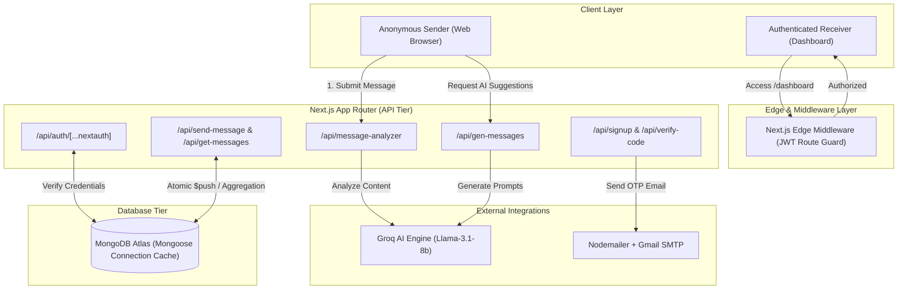

# 📥 AnonInbox — Master Interview, System Design & Anonymity Architecture Guide

---

## 📋 Table of Contents
1. [Executive Summary & Interview Pitch](#1-executive-summary--interview-pitch)
   - [The 30-Second Elevator Pitch](#the-30-second-elevator-pitch)
   - [The 2-Minute Deep-Dive Pitch](#the-2-minute-deep-dive-pitch)
   - [Problem Statement & Technical Solution](#problem-statement--technical-solution)
2. [Technology Stack & Engineering Rationale](#2-technology-stack--engineering-rationale)
3. [Technical Interview Questions & Answers](#3-technical-interview-questions--answers)
   - [Level 1: Basic & Conceptual Questions](#level-1-basic--conceptual-questions)
   - [Level 2: Intermediate & Code-Level Questions](#level-2-intermediate--code-level-questions)
   - [Level 3: Advanced System Design & Architecture Questions](#level-3-advanced-system-design--architecture-questions)
4. [Comprehensive System Design](#4-comprehensive-system-design)
   - [High-Level Architecture Diagram](#high-level-architecture-diagram)
   - [Database Data Models (Mongoose Schema)](#database-data-models-mongoose-schema)
   - [API Endpoint Contracts](#api-endpoint-contracts)
   - [Three-Tier Content Moderation Flow](#three-tier-content-moderation-flow)
   - [Bottlenecks & High-Concurrency Scaling Strategy](#bottlenecks--high-concurrency-scaling-strategy)
5. [Deep Dive: Maintaining Message Anonymity](#5-deep-dive-maintaining-message-anonymity)
   - [Current Anonymity Enforcement in AnonInbox](#current-anonymity-enforcement-in-anoninbox)
   - [Metadata Leakage & Security Vectors](#metadata-leakage--security-vectors)
   - [Enterprise Zero-Knowledge Anonymity Architecture](#enterprise-zero-knowledge-anonymity-architecture)

---

## 1. Executive Summary & Interview Pitch

### The 30-Second Elevator Pitch
> **"AnonInbox** is a modern, AI-moderated anonymous feedback platform built on **Next.js 15**, **TypeScript**, **MongoDB**, and **NextAuth.js**. It enables users to create personal profile links to receive constructive feedback while keeping senders completely anonymous. What sets AnonInbox apart from traditional anonymous confession or feedback apps is its **three-tier AI content moderation pipeline** powered by Groq and the Vercel AI SDK—which dynamically detects, rewrites, or blocks harmful messages, hate speech, and harassment in real-time before they reach the receiver."

---

### The 2-Minute Deep-Dive Pitch

#### **Problem Statement**
Anonymous feedback tools traditionally suffer from two major flaws:
1. **Toxicity & Cyberbullying:** Without identity accountability, platforms quickly degrade into hotbeds for harassment, severe insults, and hate speech.
2. **Poor User Experience & Lack of Context:** Senders often don't know what to write, while receivers lack granular control over when and how they receive feedback.

#### **Solution & Architectural Approach**
AnonInbox solves these challenges through:
- **Zero-Login Anonymous Submissions:** Senders can navigate to any user's profile (`/u/[userName]`) and submit feedback without creating an account or leaking session credentials.
- **Real-Time AI Moderation Pipeline:** Before a message hits MongoDB, it flows through client-side Zod validation, local regex checks (`messageAuthenticityCheckSchema`), and an LLM classification engine (`groq('llama-3.1-8b-instant')`). Messages are classified into:
  - 🟢 **ALLOWED:** Saved directly to MongoDB.
  - 🟡 **WARNING:** Aggressive tone detected; AI suggests an improved, respectful rewrite in an interactive dialog.
  - 🔴 **BLOCKED:** Harmful/violating content blocked immediately.
- **Dynamic AI Icebreakers:** Senders struggling to draft messages can trigger real-time AI suggestions generated via Groq LLM.
- **Secure Receiver Dashboard:** Authenticated receivers manage their profile, toggle message acceptance (`isacceptingMessage`), delete messages, and copy their shareable profile link.

---

## 2. Technology Stack & Engineering Rationale

| Layer | Technology | Engineering Rationale |
| :--- | :--- | :--- |
| **Framework** | **Next.js 15 (App Router)** | Hybrid rendering, optimized API routes, route middleware, and server-side execution. |
| **Language** | **TypeScript** | End-to-end type safety across schemas, API responses, and React state. |
| **Database** | **MongoDB & Mongoose ODM** | Schema flexibility; subdocument embedding (`messages` inside `User`) for atomic writes and fast queries. |
| **Authentication** | **NextAuth.js (JWT Strategy)** | Stateless, credentials-based JWT authentication; custom session callbacks for edge middleware integration. |
| **AI Integration** | **Vercel AI SDK & Groq API** | Low-latency inference (`llama-3.1-8b-instant`) for fast moderation and context-aware feedback suggestions. |
| **Validation** | **Zod & React Hook Form** | Dual-layer schema validation on both client and server API endpoints. |
| **Styling & UI** | **Tailwind CSS + shadcn/ui** | Responsive, accessible UI components built with Radix Primitives and Next Themes (Dark/Light mode). |
| **Email Engine** | **Nodemailer + React Email** | JSX-rendered transactional HTML templates for OTP verification and password reset flows. |

---

## 3. Technical Interview Questions & Answers

### Level 1: Basic & Conceptual Questions

#### **Q1: Why did you choose Next.js App Router over the traditional Pages Router for this project?**
> **Answer:** 
> "I chose the Next.js App Router because of its modern architecture:
> 1. **Route Groups & Layouts:** `(auth)` route groups allow shared layouts for authenticated/unauthenticated routes without affecting URL structures.
> 2. **Built-in Middleware Support:** Modern Edge Middleware (`middleware.ts`) makes route protection based on JWT tokens crisp and fast.
> 3. **Server & Client Components:** Clear separation between dynamic server-rendered pages and interactive client components (`'use client'`)."

#### **Q2: How does NextAuth.js manage sessions in this application?**
> **Answer:** 
> "AnonInbox uses NextAuth.js configured with the **JWT Session Strategy** (`session.strategy = 'jwt'`). 
> - On credentials authorization in `src/app/api/auth/[...nextauth]/option.ts`, we verify the hashed password using `bcryptjs`.
> - Custom callbacks (`jwt` and `session`) inject custom fields (`_id`, `userName`, `isVerified`, `isAcceptingMessages`) directly into the JWT token and session object. This eliminates the need for database session lookups on protected page requests."

#### **Q3: How do you handle schema validation on client forms versus backend API endpoints?**
> **Answer:** 
> "We use **Zod** for unified type-safe validation. On the client, React Hook Form is coupled with `@hookform/resolvers/zod` to prevent redundant server round-trips. On backend API routes, incoming request bodies are validated using `.safeParse()` against schemas like `signUpSchema` or `messageSchema` to prevent malformed data injection."

---

### Level 2: Intermediate & Code-Level Questions

#### **Q4: Explain the MongoDB Aggregation Pipeline used in `get-messages/route.ts`. Why unwind the array?**
> **Answer:** 
> "In our data model (`src/models/User.ts`), messages are stored as an array of embedded subdocuments inside the User schema. To sort received messages by date (`createdAt: -1`), we use a MongoDB aggregation pipeline:
> ```ts
> const userAggregation = await UserModel.aggregate([
>   { $match: { _id: userId } },
>   { $unwind: '$messages' },
>   { $sort: { 'messages.createdAt': -1 } },
>   { $group: { _id: '$_id', messages: { $push: '$messages' } } }
> ]);
> ```
> 1. `$match` filters down to the target user.
> 2. `$unwind` deconstructs the `messages` array into individual documents so MongoDB can index and sort them.
> 3. `$sort` orders the individual message documents by descending timestamp.
> 4. `$group` re-aggregates the sorted messages back into a single array under the user document."

#### **Q5: How do you prevent excessive API calls while checking username availability in real-time?**
> **Answer:** 
> "In `src/app/(auth)/sign-up/page.tsx`, we use `useDebounceCallback` from `usehooks-ts` with a **300ms delay**. As the user types into the input field, state updates are debounced. The `useEffect` triggers the GET request to `/api/check-user-unique?userName=${userName}` only after the user stops typing for 300ms, minimizing server load."

#### **Q6: Why is `connectDB()` implemented with connection caching, and what problem does it solve in serverless environments?**
> **Answer:** 
> "In serverless frameworks like Next.js API routes, incoming requests trigger stateless lambda-like executions. Creating a new database connection on every request causes MongoDB connection pool exhaustion and performance degradation.
> 
> In `src/lib/dbConnect.ts`, we maintain a global object `connection.isConnected = db.connections[0].readyState`. If `connection.isConnected === 1` (connected), we reuse the active connection, guaranteeing low latencies and preventing connection leaks."

---

### Level 3: Advanced System Design & Architecture Questions

#### **Q7: Walk me through the exact pipeline of how an incoming message is moderated from sender to database.**
> **Answer:** 
> ```text
> [Sender Client] 
>       │
>       ├──> 1. Client Regex Pre-check (Fast rejection / Instant warning)
>       │
>       └──> 2. POST /api/message-analyzer
>                     │
>                     ▼
>        [Groq Llama-3.1 Engine]
>                     │
>        ┌────────────┼────────────┐
>        ▼            ▼            ▼
>    ALLOWED       WARNING      BLOCKED
>        │            │            │
>        │            ├──> Prompt User Rewrite  
>        │            └──> User Accepts AI Rewrite ──┐
>        │                                           │
>        └───────────────────┬───────────────────────┘
>                            ▼
>                 POST /api/send-message
>                            │
>                     [MongoDB Write]
> ```
> 1. **Client Pre-check:** Client runs fast regex validation (`messageAuthenticityCheckSchema`) to detect explicit profanity/violence locally.
> 2. **LLM Moderation:** The payload is sent to `/api/message-analyzer`. It executes a zero-shot prompt against `llama-3.1-8b-instant` via Groq. The model returns strict raw JSON matching `AiResponseSchema`.
> 3. **Classification Actions:**
>    - `ALLOWED`: Message proceeds directly to `/api/send-message`.
>    - `WARNING`: UI opens a custom modal presenting the original text alongside an AI-suggested respectful rewrite. The sender can accept the rewrite or manually edit.
>    - `BLOCKED`: UI prevents submission entirely and alerts the sender.

#### **Q8: If 10,000 users send messages simultaneously, what bottlenecks will this system face and how would you redesign it?**
> **Answer:** 
> "At high concurrency, key bottlenecks include:
> 1. **MongoDB Write Lock / Array Growth:** Appending to an embedded array (`$push` into `messages`) creates unbounded subdocuments, which can breach MongoDB's 16MB document size limit and cause write amplification.
> 2. **Groq API Rate Limits:** Synchronous LLM calls in the request path increase latency (~300-800ms per request) and hit API rate limits.
> 
> **Production Redesign:**
> - **Decouple Data Model:** Move `Message` to an isolated collection indexed on `userId` + `createdAt`.
> - **Asynchronous Queue Pipeline:** Put incoming messages onto a Redis/RabbitMQ queue. Background worker processes handle AI moderation asynchronously, pushing valid messages to MongoDB and delivering notifications via WebSockets."

---

## 4. Comprehensive System Design

### High-Level Architecture Diagram



---

### Database Data Models (Mongoose Schema)

```typescript
// Message Embedded Subdocument Schema
const MessageSchema = new Schema<Message>({
  content: { 
    type: String, 
    required: true 
  },
  createdAt: { 
    type: Date, 
    required: true, 
    default: Date.now 
  }
});

// User Document Schema
const UserSchema = new Schema<User>({
  userName: { type: String, required: true, trim: true, index: true },
  email: { type: String, required: true, unique: true, trim: true },
  password: { type: String, required: true },
  verifyCode: { type: String, required: true },
  verifyCodeExpiry: { type: Date, required: true },
  isVerified: { type: Boolean, default: false },
  isacceptingMessage: { type: Boolean, default: true },
  forgotPasswordCode: { type: String },
  forgotPasswordCodeExpiry: { type: Date },
  messages: [MessageSchema] // Embedded subdocument array
});
```

---

### API Endpoint Contracts

#### **`POST /api/message-analyzer`**
- **Description:** Sends message text to Groq LLM for content classification.
- **Request Body:** `{ "message": "string" }`
- **Response Format:**
  ```json
  {
    "success": true,
    "message": {
      "state": "WARNING",
      "improved_message": "I think the project execution could be organized better."
    }
  }
  ```

#### **`POST /api/send-message`**
- **Description:** Pushes an approved message to a target user's MongoDB profile.
- **Request Body:** `{ "username": "anirudha", "content": "Great work on the release!" }`
- **Response Format:**
  ```json
  {
    "success": true,
    "message": "Message sent successfully"
  }
  ```

---

### Bottlenecks & High-Concurrency Scaling Strategy

1. **MongoDB BSON 16MB Document Limit:**
   *Current Implementation:* Messages are stored inside an embedded array `messages: [MessageSchema]` under `UserModel`. If a popular user receives tens of thousands of feedback items, the single User BSON document will exceed MongoDB's 16MB limit.
   *Scaling Solution:* Normalize the schema into a standalone `MessageModel` collection linked by `userId: ObjectId` with a compound index `{ userId: 1, createdAt: -1 }`.

2. **Synchronous LLM Latency:**
   *Current Implementation:* Senders wait synchronously (~400-900ms) for Groq to classify messages.
   *Scaling Solution:* Introduce an Event-Driven Queue (Kafka / RabbitMQ / Upstash Redis). Senders receive an immediate `202 Accepted` response while background workers process moderation and push approved items asynchronously.

---

## 5. Deep Dive: Maintaining Message Anonymity

Anonymity is the core value proposition of AnonInbox. Here is an architectural analysis of how anonymity is protected today, vulnerability risks, and how to scale to an enterprise Zero-Knowledge design.

---

### Current Anonymity Enforcement in AnonInbox

```text
Sender Device ─────────> Next.js API Route ─────────> MongoDB Document
(No Session,              (Strips NextAuth Context,    (Stores ONLY:
 No Auth Header)           Extracts ONLY {content})     {content, createdAt})
```

1. **Zero-Session Requirements for Senders:**
   The public profile route (`/u/[userName]`) and `/api/send-message` endpoint do not require authentication, sessions, or JWT headers.
2. **Schema-Level Data Isolation:**
   The `MessageSchema` in MongoDB explicitly stores **only two properties**:
   - `content` (String)
   - `createdAt` (Date)
   - `_id` (Auto-generated ObjectId)
   
   It contains **zero fields** for `senderId`, `IP address`, `User-Agent`, or geolocation.
3. **Unlinkable Data Writes:**
   Because incoming messages are pushed into the receiver's `messages` array, database logs reveal who received a message, but contain zero database references or foreign keys linking back to the sender.

---

### Metadata Leakage & Security Vectors

Even when the application database avoids storing sender identities, anonymity can be compromised via side-channel vectors:

| Vulnerability Vector | Risk Mechanism | Mitigation Strategy |
| :--- | :--- | :--- |
| **1. Server Access Logs (IP & Header Leaks)** | Nginx/Vercel/AWS access logs capture sender IP addresses, User-Agents, and timestamps. | Strip `X-Forwarded-For`, `X-Real-IP`, and request headers at the edge reverse proxy layer before invoking API handlers. |
| **2. Timing Attacks & Correlation** | A receiver comparing a message's `createdAt` timestamp with server access log timestamps can correlate a message to a visitor's IP. | **Timestamp Fuzzying:** Round timestamps to the nearest hour or insert randomized delay buffers before writing to DB. |
| **3. Browser Fingerprinting & Session Leaks** | Senders accidentally sending auth cookies or browser session headers with public submissions. | Enforce strict CORS rules, strip all `Cookie` headers in backend middleware for public `/api/send-message` routes. |
| **4. AI Moderation Prompt Logging** | Senders writing personal identifying details, or third-party LLM providers keeping prompt logs. | Zero-data-retention contracts with AI providers (Groq/OpenAI Enterprise), and client-side PII scrubbing prior to moderation API calls. |

---

### Enterprise Zero-Knowledge Anonymity Architecture

To make message anonymity cryptographically non-traceable at enterprise scale, upgrade the platform to a **Zero-Knowledge Message Relay Pipeline**:

```mermaid
flowchart LR
    Sender Browser -->|1. Client Encrypts Text| ClientSide
    ClientSide -->|2. Strip IP & Headers| ProxyRelay["Anonymizing Proxy / Cloudflare Worker"]
    ProxyRelay -->|3. Mixnet Buffer (Randomized Delay)| Queue["Delay Buffer (5-15 mins)"]
    Queue -->|4. Batch DB Write| MongoAtlas[("MongoDB (No IP / Timestamp Fuzzed)")]
```

#### Key Technical Upgrades:

1. **Edge Header Anonymization Proxy:**
   Deploy a Cloudflare Worker proxy in front of `/api/send-message` that strips client IP headers (`CF-Connecting-IP`, `X-Forwarded-For`), User-Agent signatures, and TLS client identifiers before forwarding requests to the application server.

2. **Mixnet Random Delay Queuing:**
   Rather than writing messages synchronously upon submission, push messages into an encrypted Redis queue. A background cron worker flushes queued messages in random batches at randomized delay intervals (e.g., every 5–15 minutes). This completely prevents timing correlation attacks.

3. **Privacy-Preserving Rate Limiting (Hashed Daily Salts):**
   To prevent spam without tracking sender IP addresses, implement rate limiting using HMAC IP hashing with a daily-rotating secret salt:
   ```typescript
   // Cryptographic one-way hash with daily rotating secret salt
   const anonymizedIPHash = crypto
     .createHmac('sha256', process.env.DAILY_ROTATING_SALT + getTodayDate())
     .update(clientIP)
     .digest('hex');
   ```
   This enables rate-limiting abuse from a single client for 24 hours without ever storing or exposing their real IP address.
