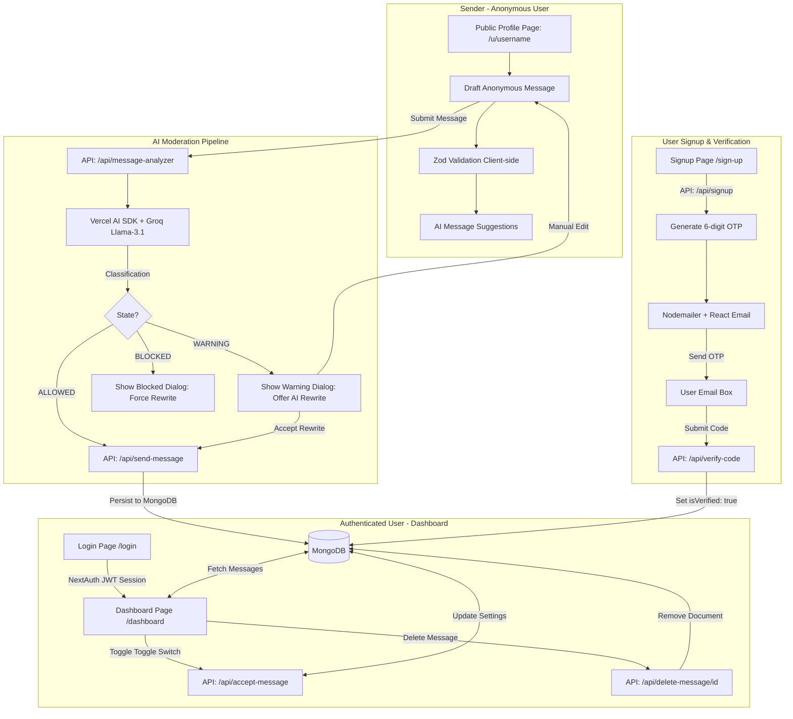

# 📥 AnonInbox — Anonymous Feedback Platform

AnonInbox is a premium, modern, and secure web application that allows individuals to create unique personal profile links to receive constructive, anonymous feedback. The platform leverages state-of-the-art AI content moderation to filter out abuse, harassment, and hate speech, while helping users refine constructive feedback.

---

## ✨ Key Features

- **Anonymous Message Boards:** Send anonymous feedback to anyone without having to create an account.
- **AI-Powered Content Moderation:** Automated scanning of incoming messages utilizing AI (via Groq and Vercel AI SDK).
  - 🟢 **ALLOWED:** Positive, neutral, or constructive negative critiques are seamlessly delivered.
  - 🟡 **WARNING:** Aggressive or disrespectful messages are flagged, and AI offers a respectful rewrite suggestion that the sender can accept.
  - 🔴 **BLOCKED:** Violations (threats, hate speech, severe harassment, illegal content) are blocked immediately.
- **Secure Authentication:** Integrated NextAuth.js credentials-based authentication with email OTP verification.
- **Password Reset Flow:** Forgot password assistance with secure verification codes sent via email.
- **Dynamic Suggestions:** AI suggestions for icebreaker messages to help senders draft helpful feedback.
- **Clean & Dark/Light Themed UI:** Implements a premium aesthetic featuring responsive layouts, custom animations, glassmorphism, and a carousel-driven landing page.

---

## 🛠️ Tech Stack

- **Framework:** [Next.js 15](https://nextjs.org/) (App Router & Server Actions / API Handlers)
- **Frontend Core:** React 19, TypeScript, TailwindCSS
- **UI Components:** [shadcn/ui](https://ui.shadcn.com/) (Radix Primitives), Lucide Icons, Embla Carousel
- **Forms & Validation:** React Hook Form & Zod
- **Database:** MongoDB via [Mongoose ODM](https://mongoosejs.com/)
- **Authentication:** [NextAuth.js](https://next-auth.js.org/) (JWT Credentials Provider)
- **AI Integrations:** Vercel AI SDK using Groq (`llama-3.1-8b-instant`)
- **Mailer Engine:** NodeMailer & React Email rendering

---

## 📐 Project Architecture & Flow

### System Workflow Diagram



---

## 📁 Codebase Directory Structure

```text
feedbackapp/
├── emails/
│   └── verificationEmail.tsx          # React Email template for OTP verifications
├── public/                            # Static assets and icons
└── src/
    ├── app/
    │   ├── (auth)/
    │   │   ├── dashboard/             # Private user dashboard page
    │   │   ├── forgot-password/       # Password recovery flow page
    │   │   ├── login/                 # User login page
    │   │   ├── sign-up/               # User signup page
    │   │   ├── verify/                # Email verification (OTP input) page
    │   │   ├── layout.tsx             # Auth layout wrapping context providers
    │   │   └── page.tsx               # Landing page with carousel
    │   ├── api/
    │   │   ├── accept-message/        # GET/POST toggling accepting messages
    │   │   ├── auth/                  # NextAuth credentials authentication handler
    │   │   ├── check-user-unique/     # Realtime username availability checker
    │   │   ├── delete-message/        # Delete received messages
    │   │   ├── forgotPassword/        # Trigger password resets
    │   │   ├── gen-messages/          # GET suggestions via Groq model
    │   │   ├── get-messages/          # Retrieve all feedback for a user
    │   │   ├── message-analyzer/      # POST verification of text courtesy
    │   │   ├── send-message/          # POST anonymous message to DB
    │   │   └── signup/                # POST user registration
    │   ├── u/[userName]/              # Public user profile pages (receiving feedback)
    │   ├── globals.css                # Global Tailwind CSS and variables
    │   └── layout.tsx                 # Root layout file
    ├── components/
    │   ├── ui/                        # Reusable shadcn UI primitives
    │   ├── MessageCard.tsx            # Renders individual feedback on dashboard
    │   ├── ModeToggle.tsx             # Light/dark mode theme toggler
    │   ├── Navbar.tsx                 # Site header navigation component
    │   └── theme-provider.tsx         # NextThemes wrapper for styling toggles
    ├── context/
    │   └── AuthProvider.tsx           # Wraps NextAuth SessionProvider context
    ├── lib/
    │   ├── dbConnect.ts               # Mongoose connection manager with caching
    │   └── utils.ts                   # Tailwind merge & styling helpers
    ├── models/
    │   └── User.ts                    # MongoDB Mongoose schemas (User & Message)
    ├── schemas/
    │   ├── signUpSchema.ts            # User registration zod rules
    │   ├── loginSchema.ts             # Login zod rules
    │   ├── messageSchema.ts           # Text validation zod rules
    │   └── verifySchema.ts            # Verification OTP validation rules
    ├── types/
    │   └── ApiResponse.ts             # Shared API Response interfaces
    └── middleware.ts                  # NextJS Middleware route shield (JWT verification)
```

---

## ⚙️ Environment Setup

Before starting the server, create a `.env` or `.env.local` file in the root directory and populate it with the following configuration:

```env
# MongoDB Connection URI
MONGODB_URI=mongodb+srv://<username>:<password>@cluster.mongodb.net/feedback

# NextAuth Config
NEXTAUTH_SECRET=your_super_secret_key_here
NEXTAUTH_URL=http://localhost:3000

# Nodemailer credentials (for sending OTPs via Gmail SMTP)
USER_EMAIL=your-gmail-address@gmail.com
PASS_EMAIL=your-app-specific-password

# Groq API Key (used for Vercel AI SDK content analyzer and message generator)
GROQ_API_KEY=gsk_your_groq_api_key
```

---

## 🚀 Running the Project Locally

### 1. Install Dependencies
```bash
npm install
```

### 2. Run the Development Server
```bash
npm run dev
```
Open [http://localhost:3000](http://localhost:3000) with your browser to see the result.

### 3. Build for Production
```bash
npm run build
npm run start
```
